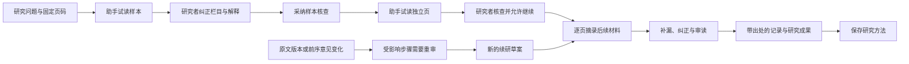

# 研究助手：从试读到可核查结果

入口：项目左侧「研究计划」→「新建研究计划」→「由助手分步推进」。

这次实现复用现有 D1、R2、研究队列、模型连接和项目预算，没有新增固定订阅。所有付费流程先保存草案，点击开始才执行。模型结果、出处匹配和研究者采纳是三种不同的状态。

## 已实现

| 任务               | 实际行为                                                                                 | 需要研究者完成的判断                                 |
| ------------------ | ---------------------------------------------------------------------------------------- | ---------------------------------------------------- |
| 按问题批量摘录     | 自定义栏目；跨资料交错取样；样本纠正；独立页核查；逐页处理后续材料；汇总查找与 CSV 导出  | 栏目是否合理、是否遗漏、分类和解释是否成立           |
| 审读论证与反证     | 检查论述的作者声音、时间地域范围、证言依赖、制度声明与实施证据；保留替代解释和下一步建议 | 来源批判与历史解释                                   |
| 沿线索寻找材料     | 模型提出历史称谓/跨语言检索词；实际检索；评估缺口后再追踪一轮；从已检索结果生成阅读清单  | 是否值得取得全文、是否充分覆盖相关材料               |
| 寻找值得对读的段落 | 在明确选定的页内做模型语义对读，展示两侧原文、相似处与限制                               | 相似是否有历史意义；不能据此自动断定抄袭、同源或因果 |
| 评估新材料的影响   | 对照已有解释，指出支持、挑战和未能判断的部分；资料版本变化停止旧任务，并提供续研草案     | 哪些解释需要改变                                     |
| 复用研究方法       | 保存问题、栏目和纠正后的研究要求；下一次选择新材料再运行；备份保留方法与纠正历史         | 一套方法能否迁移到另一类材料                         |

## 摘录与审读

- 每个非空栏目都必须引用一条实际原文；缺失值必须为空，推测单独标记。
- 模型实际收到指定页，而不是只在提示词中被要求忽略其它页。
- 研究者可以改值、改分类、删记录、补充遗漏记录、补充精确引文，并更新本页覆盖说明。补充引文必须定位到这一步读过的固定页。
- 纠正保留前后内容、操作者、时间与依据；并发编辑不会静默覆盖。
- 已完成的下游研究在上游纠正后需要重审；旧成果显示后续修改提示。
- 研究计划内有统一摘录列表，可以按人物、地点、栏目值查找，也能逐条回到对应步骤。
- 摘录计划最多 1,000 个选定页，每页最多 20 条记录；试读样本和独立页通过后，每批最多 20 页，研究者采纳本批核查后才能进入下一批。比较等其它方法仍最多 24 页。页面明确显示范围，支持跳过之前读过的页；完整排程不等于已完整提取全部历史信息。

## 定向检索

默认只查选定资料的页。研究者勾选后才向 Crossref 和美国国会图书馆目录发送检索词；最多两轮，每轮最多三个词。不发送模型密钥或整份原件。

检索记录保留查询词、目录、时间、返回数、上限和失败状态。目录来源标注为「尚未读取全文」，不会被自动当成已读史料。阅读清单只允许引用实际返回的候选 ID，链接和标题由检索结果补齐，不能由模型自行编造。找到的目录项由研究者决定是否导入全文。

语义对读是选定页内的模型比较。另已加入当前项目文字的关键词 / 别名 / 向量混合检索与 embedding 缓存，使用现有 D1，最多 5,000 段；没有增加 LanceDB 或 Vectorize。图片相似搜索尚未实现。最新入口与验证见 [生产力功能](productivity-workflows.md)。

## 增量续研与费用

资料新增版本会标记已有输入对应的任务，并产生项目提醒。排队任务不会继续使用已被标记的旧输入；已发送的模型调用无法撤回，但不能覆盖更新后的研究状态。

「用更新材料继续研究」创建新草案。未受影响且已完成的工作通过来源任务和结果摘要校验复用；受影响的步骤改用最新材料版本。新草案仍需要点击开始，预算预留与不确定调用不自动重试的规则继续生效。

每项任务显示已记录费用；即便输出未通过格式或引文核查，已发生的模型费用也会记入对应任务。收费依据仍以模型厂商账单为准。

## 2026-09-05 较早一轮验证记录

真实试跑使用公开 LED / Heidelberg 的 HD010001、HD010002、HD010004，来源与授权保留在研究备份。使用已授权 OpenRouter 连接的 GLM 5.3 Flash。

- 首次试跑的一项输出未通过格式/引文解析，流程停在待确认状态，没有自动重试。
- 后续受控试跑完成了三个付费摘录步骤及样本、独立页、后续批次与汇编流程。该次按设定费率计入约 $0.001371；加上之前受控试跑共约 $0.002246。这里是应用费率估算，不是读取的供应商账单。
- 原文引文能精确匹配；日期未按皇帝姓名或年龄补推。
- 人工开发核查发现模型将亲属关系填入职衔、将不确定分类标为明示。通过真实本地 API 保存两项纠正，四个下游步骤变为需要重审。这个案例说明：精确引文无法代替语义和学术判断。
- 公开材料通过真实登录、上传、保存方法、导出与恢复接口验证；未登录读取方法返回 401。
- 72 项自动化测试全部通过；自动化测试覆盖样本/独立页门槛、限定页码、完整上游上下文、预算、模型调用去重、人工补录、跨页引用拒绝、并发纠正、源版本变化、增量复用、目录失败、候选来源约束、备份恢复和删除清理。
- 当前电脑锁屏，未完成本轮 Chrome 视觉与点击回归；不能据此声称界面已通过人工视觉验收。

可导入的案例：`work/agentic-pilot/LED-reviewed-pilot.zip`。研究结果：`work/agentic-pilot/result.json`；纠正与状态：`work/agentic-pilot/review.json`。

以上是软件与小样本工作流程验证，不是历史研究准确率、节省时间或发现新历史结论的验证。仍需专业研究者对更大的独立材料集进行栏目分类、遗漏率与总核查时间评估。

## 较早一轮部署

迁移 `0013_research_methods.sql` 已在本地与生产应用。后台 Worker：`ea50ccc5-f4c7-420f-8ee5-3c4ec19b7b57`；网站 Worker：`df5ec1e1-7650-4638-8e78-357136969fe4`。主页和隐私页返回 200，未登录的研究方法接口返回 401；线上 workspace 脚本摘要与本次构建一致。详见 `work/agentic-production-checks.json`。
