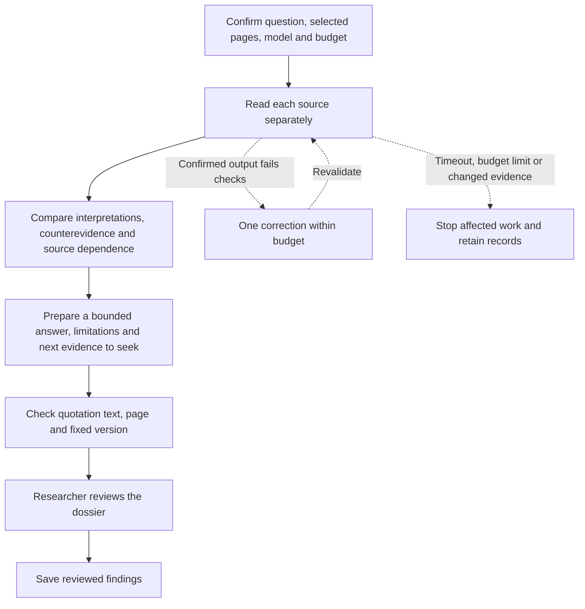

# Background research preparation

Choose **Background dossier: read, challenge and synthesize** in a research plan. Select the material, state a bounded question and confirm the model and project budget before starting. The Chinese label is **后台研究准备：逐份阅读、质疑与汇总**.

This prepares a reviewable research dossier while the researcher is away. It does not approve evidence or publish a paper on the researcher's behalf.

The same single-correction limit applies to the comparison and synthesis steps. A correction is another model call and consumes the existing project budget. It is never an unlimited retry loop. A provider timeout or uncertain response is not automatically replayed.

## What runs unattended

- Read the selected pages from each source, preserving author, date, editorial boundaries and uncertainty.
- Compare those readings against the original pages. Flag overstatement, competing interpretations and dependence between sources.
- Prepare a source-linked report and proposed next-reading priorities. Proposed searches are not represented as completed searches.
- Validate source references and stop at a final human review. Earlier assistant outputs are working material, not independent evidence.

A round covers at most 10 sources and 24 selected pages. Material and dependency size limits may require a smaller round. This workflow does not silently expand the corpus or import new material.

## Citations and recovery

The application numbers fixed source passages. The model selects those numbers; Canwoo supplies the original text, version, page and character offset. Grouped references such as `[P8, P9]` are resolved without altering the selected passages. Unknown numbers are rejected. Exact quotation matching establishes traceability, not whether an interpretation is justified.

When the research worker loses its execution lease after a response has been saved, background maintenance can resume from that saved response. It checks the execution attempt, current source versions and upstream inputs before applying it. It neither calls the provider again nor counts the same response cost twice. Paused plans wait; changed sources or dependencies prevent the old response from advancing the plan.

The execution history retains paid requests, failures and output corrections. If the correction still fails, inspect the response, revise the task or choose a more capable model before starting another attempt. The original response remains available.

## Interpreting readiness

A completed preparation round means a researcher has a dossier to check. It does not mean the model has found all relevant archives, resolved every disagreement or produced an independently validated historical conclusion. Review the primary passages and the competing readings before accepting findings or using them in a manuscript.
