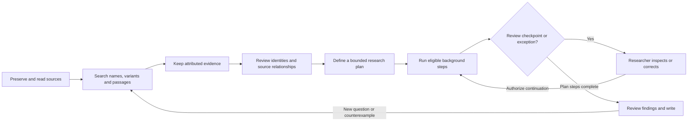

# Background research and a connected researcher experience

This change improves unattended execution within a researcher's authorized plan. It does not introduce autonomous acceptance of historical claims, automatic paid retries, or additional infrastructure subscriptions.

## Where to start

- **Project overview → Your research path, connected**: choose a stage to see its purpose, expected output and a link to the relevant feature. Source, evidence and note counts reflect the project; they are not measures of research quality.
- **Feature pages → What is this for, and what comes next?**: contextual help connects reading, search, evidence, people and source relationships, arguments, research plans, findings and writing. Related guidance also covers bibliography, Drive, collaborators, budgets, history, exports and external agents.
- **A research plan → Background research status**: separates automatic work, human review and problems requiring inspection. Direct links open the affected steps. A working branch can coexist with another branch awaiting review.

## Recovery defects fixed

1. Scheduled maintenance previously stopped at the first rejected operation. A cleanup failure could prevent research recovery, and a source-watch failure could prevent material preparation. Independent operations now finish in sequence despite another operation failing. The scheduled invocation still reports failure after the remaining operations finish, using operation names rather than potentially sensitive error payloads.
2. Recovery previously scanned the oldest 30 active plans, including plans entirely waiting for human review. Those plans could indefinitely exclude later work. The bounded scan now selects plans with actionable dependency transitions, automatic steps ready to dispatch, invalidated dependencies to propagate, or completion to record. Human gates remain intact.
3. A failed queue handoff previously prevented dispatch of later independent steps in the same plan. Each handoff is now isolated; queued state remains recoverable. Re-sending a queue message does not create a new paid attempt: the existing task claim and terminal-state checks still apply.
4. Recovery no longer re-sends queued work belonging to paused or cancelled plans. Already transmitted model requests may still finish; pausing does not retract them.

The existing production schedule remains every 15 minutes. Normal next-step dispatch occurs when a task finishes; cron is a recovery path, not a promise of instant recovery. No migration, new queue or additional database service is required.

## Validation and limits

The regression uses a local Cloudflare D1 runtime with 31 earlier review-gated plans and a later runnable plan. It injects a failed queue handoff, verifies that an independent sibling is dispatched, recovers the lost handoff, pauses and resumes the plan, executes real built-in source searches, rejects duplicate execution of completed work, and stops at the human review checkpoint. No browser event drives the execution sequence and no paid model call is made. Separate tests cover maintenance failure isolation and status classification when working, review and uncertain branches coexist. The complete suite passed 225 tests with no failures or skips, including restore from the existing Adams project archive. TypeScript, lint, formatting, the Cloudflare app build and research-worker dry run passed. Chrome acceptance was initially blocked by the locked Mac; the follow-up below records the completed desktop pass.

The queue transport in this regression is controlled to inject errors; it is not a production outage simulation. Existing model-call, budget, citation, source-change and permission regressions remain applicable. This pass does not establish collection-scale extraction accuracy, reduced scholarly review time, unlimited throughput, or automatic acquisition and assessment of new primary sources. Browser acceptance must be recorded separately from build and runtime checks.

## Chrome acceptance follow-up

On 2026-09-07, the signed-in production Adams correspondence project was used for desktop click and visual acceptance. The pass covered the research-path selectors and links into plans, people and source context, and writing; contextual guidance linking context to search and findings to notes; the plan flow diagram; and background-status links into human review and uncertain model attempts. The review task remained pending. The uncertain attempt displayed the incomplete-response warning and possible charges, with no automatic paid retry triggered.

Two defects were found and fixed:

- The new overview path shared a CSS class with the landing page. Inherited flex rules squeezed the description into narrow columns. Dedicated `research-journey` classes and a stacked header now keep the explanation and next action readable. Chinese and English desktop layouts were inspected, including the English dark theme.
- Overview quick search did not expose the similar-spelling option available in dedicated search. It now uses the same opt-out option, labels approximate hits and reports source-page counts. In the five-letter project, `adam` returned five pages with similar spellings enabled and zero with it disabled. Opening the May 7 result returned to its saved version, page 1, with the existing highlight visible. Similar spelling remains a retrieval aid, not an identity assertion.

TypeScript, lint, comment checks, formatting and the production app build passed for these fixes. This follow-up used existing research records without submitting review decisions or making paid model calls. It does not add mobile-device, new provider-call or large-collection acceptance evidence.
