# From reviewed research to a manuscript draft

Open **Notes & writing → Draft from research**. This workflow turns a bounded set of reviewed arguments into a new, editable initial draft. Researchers do not have to complete every module before writing.

```mermaid
flowchart LR
  A[Read sources and save evidence] --> B[Review claims and alternatives]
  B --> C[Confirm evidence, outline and budget]
  C --> D[Freeze the research dossier]
  D --> E[Draft chapters sequentially]
  E --> F[Check references and coverage]
  F --> G[Save a new versioned note]
  G --> H[Researcher reviews and revises]
  H --> I[Export with source references]
```

## Researcher workflow

1. Choose a research question and its reviewed claims or alternatives. Draft claims are not eligible. Link each selected claim to supporting, challenging or contextual evidence.
2. Inspect the selected excerpts and original pages. The preview also shows relevant people, their review status, source relationships and available bibliography records. Unconfirmed identities remain uncertain.
3. Edit the title, audience, language and two to eight chapter goals. Select a saved model, enter its rates and confirm a run budget. This produces a short initial draft, not a full-length publication-ready article.
4. Confirm the dossier and start. The existing research plan shows each stage, dependencies, execution status and any failure. Closing the browser does not stop queued work.
5. Open the new note when ready. Paragraphs link back to source pages and distinguish source statements, interpretations and research gaps. The original research and existing notes are not overwritten. Continue editing using the normal editor, version history and export tools.

## Application guarantees and limits

- The run freezes selected claims, evidence, source versions, relevant entities, bibliography and material relationships. A change to those inputs stops subsequent drafting or acceptance and flags the run for review. It does not silently rewrite a researcher's note.
- Every substantive paragraph must reference a selected claim and an associated excerpt. New manuscript calls select numbered dossier excerpts; Canwoo supplies their exact quotation, version and page. References are checked against the frozen evidence and source text; unknown references, invented quotation strings and unsupported reference indices are rejected. Repeated citations reuse the same reference number across chapters.
- Coverage checks identify selected claims and challenging excerpts absent from the generated paragraphs. Missing items remain visible in the note. Citation presence and coverage are **not** semantic proof that an interpretation is correct or that counterarguments have been adequately addressed.
- The initial note and assembly result are saved atomically under the active task lease. A duplicated request or expired worker cannot create another initial note. Later researcher edits are separate note versions.
- Chapters run sequentially using the existing job queue. Both the project budget and the run's cumulative reservation limit are checked before a paid call. Rates are supplied by the user; these are application estimates, not a hard provider billing cap. Failed or uncertain calls may retain reserved cost.
- A provider timeout is recorded as uncertain and is not automatically retried. Inspect its execution record before deciding whether to retry. Invalid completed model output is reported separately from an uncertain request.
- Final prose stays pending human review. Literature coverage, historical interpretation, translation, authorship and publication suitability still require scholarly judgment.

## Validation

`tests/manuscript.test.ts` exercises the workflow against a local D1 instance: concurrent creation, chapter dependencies, deterministic paragraph rendering, citation validation, stale research, per-run spending, uncertain calls, missing arguments and counterevidence, lease-safe note saving, preservation of edits and DOCX source references. Injected model responses isolate application behavior from provider availability; they do not measure a model's historical reasoning.

The hosted pilot uses a separately labelled question about Abigail Adams's 7 May 1776 letter and a checked excerpt concerning absolute power over wives. This narrow case is useful for testing whether the workflow preserves the boundary between marital power and a complete voting-rights proposal. It is not an independent scholarly evaluation of the wider product.

### Hosted pilot outcome, 7 September 2026

The browser exercise used an existing project, preserved its original unreviewed claims, and created a separately labelled test question after checking the source page. The evidence preview, outline editor, background plan and failure navigation worked. The first GLM 5.3 Flash response returned ordinary analysis and citations outside the selected excerpt; application validation stopped it. The implementation was then corrected to request a constrained paragraph schema and remove the conflicting generic analysis instructions.

Two subsequent calls started responding but did not finish within the existing 90-second low-effort request limit. They remained uncertain, kept their reservations and did not trigger automatic retries, later chapters or a partial note. Paid retries were stopped. The run's budget was $0.05; retained reservations are not a confirmed provider bill.

The full regression run passed 229 tests with one external-backup-fixture test skipped. Five focused manuscript tests also passed after the final citation and review checks. **A complete manuscript from the live provider was not produced in this pilot.** Saving, editing and export were validated with injected model responses; they must not be presented as a successful live-provider end-to-end result.

### Subsequent local workflow exercise, 7 September 2026

A restored copy of the Adams case completed a two-section draft with a real Gemini 2.5 Flash Lite control connection after citation selection was changed to numbered dossier excerpts. The operator read and revised overstatements, exported the result with DOCX source footnotes, and restored a backup containing the draft and its revision. Final acceptance remained pending. The GLM request in this exercise timed out; the default model was not changed. See the [full validation record](workflow-e2e-2026-09-07.md) for scope, costs, limits and remaining browser checks. This follow-up does not change the failed outcome of the earlier hosted pilot.
