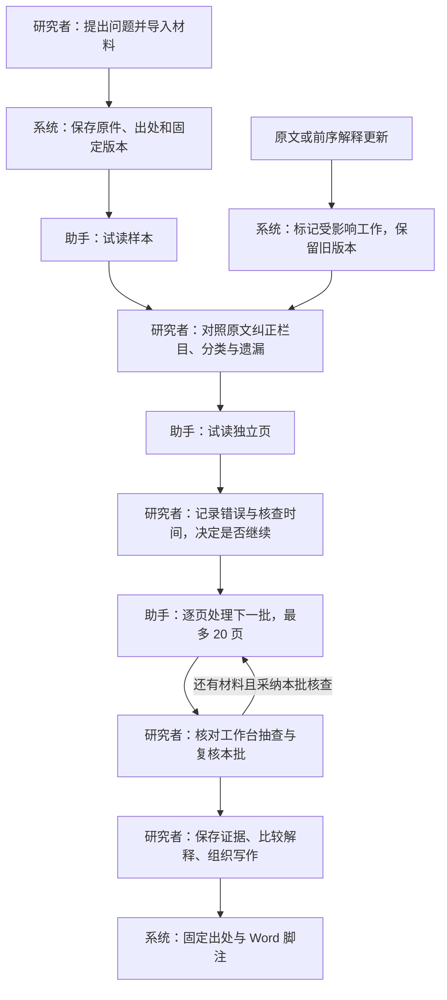

# 从材料到可核查写作

2026-09-05。以下功能复用已有 Cloudflare D1、R2、Queues 与 BYOK，没有新增固定基础设施订阅。目标是减少重复阅读、整理和交接，不把模型生成量当作历史研究进展。

## 从哪里开始

| 研究者的工作       | 入口与已实现行为                                                                                                                              |
| ------------------ | --------------------------------------------------------------------------------------------------------------------------------------------- |
| 导入档案           | 「导入资料」支持 IIIF Presentation 2 / 3 清单，选择图像页，保留清单、原始页序、出处和许可；Zotero 支持个人 / 群组书目库与已同步 PDF、图片附件 |
| 试读并确定方法     | 「研究计划」选择摘录栏目，先读样本，研究者纠正后再试独立页                                                                                    |
| 核查助手的摘录     | 计划内「核对工作台」显示页级进度、问题与失败、普通结果抽查和独立页；编辑区并排显示固定版本文本与原件，点击引文定位原话                        |
| 记录方法是否有效   | 每页「记录人工评估」保存遗漏、误收、字段 / 分类错误、核查与返工时间，可填同类材料纯人工耗时；评估绑定当时结果和输入页                         |
| 继续处理材料       | 一次摘录计划最多 1,000 页，每批最多 20 页，批次间须采纳人工核查；可暂停和继续，已有队列、预算及幂等机制继续生效                               |
| 找到不同说法的线索 | 资料检索中的「按意思查找」结合原词、别名与向量排序，点击返回固定页；缓存仅针对当前资料版本                                                    |
| 写作与引注         | 笔记编辑器内「引用、论证提纲与 Word 导出」可插入已保存证据、按支持 / 挑战关系组织提纲，导出真实 Word 脚注                                     |
| 分工与讨论         | 证据和研究步骤可以展开讨论；人工步骤可以分配给现有有权限成员，保存操作者和时间                                                                |
| 继续上次研究       | 项目概览显示最近材料、等待人工审读的步骤和已更新资料影响到的论证，直接打开对应工作                                                            |

模型结果、原文匹配和研究者采纳分别记录。栏目填满、引文能匹配、任务执行成功均不代表历史判断正确。评估记录也不会自动授予研究成果「准确」状态。

## 范围与成本

- 摘录计划上限 1,000 页；其它方法仍最多 24 页。每页最多 20 条记录，达到上限会进入重点核查范围；不是无限量提取。任务多于 40 个时默认列表，避免不可读的大图。页面选择不改变既有单份资料导入上限。
- 语义检索使用 OpenRouter 的 `openai/text-embedding-3-small`，256 维；每批准备最多 16 段，段长 2,400 字符并有重叠，每项目最多 5,000 段。只发送文字，索引和每次查询都使用用户余额及项目预算；调用前读取目录费率，超过 $0.10 / 百万输入 token 或费率未知时不开始。应用预算不是供应商账单硬限额。
- 索引准备由当前打开的网页逐批发起，可暂停后续请求并稍后续建；不是关页后仍运行的后台导入。已有段落不会重复索引。恢复备份后需重新准备，派生向量缓存不打包；新增版本会排除旧版本。尚未准备的文字不在向量候选中。
- D1 保存向量，检索逐批计算相似度，适用于当前小规模项目；尚未针对 5,000 段并发使用做性能验收。未引入多模态数据库、图片相似检索或新的外部向量服务。
- Word 输出支持标题、段落及静态脚注，保留引文、固定版本和回到项目的链接；不是 Zotero 动态引用域或完整 Word 排版编辑器。找不到的证据引用会阻止导出，而不是悄悄生成脚注。
- Zotero 需要用户有读取权限的 key，暂存于当前界面、请求中使用，不写入数据库；附件限已同步的 PDF / JPEG / PNG / WebP，不是持续双向同步。当前未使用真实 Zotero 私有库做验收。
- IIIF 按选定 canvas 导入单页公开图像，保留原清单；不是自动导入整本书。跨站读取依赖馆藏 CORS，支持上传下载好的清单。许可缺失时明确显示缺失，不自动推断许可。原件上传仍遵守已有单文件 20 MB 限制。
- 人工评估绑定结果快照，结果变更后旧评估标为历史；仅分配人员或改变任务状态不会使未改动的结果评估过期。记录是研究者填写的观察，不是自动算出的学术准确率。抽查是稳定的系统抽样，不作为统计置信区间。
- 讨论复用项目权限，无额外私信或邮件。分配人员用于协作安排，不新增复杂审批层级；有相应项目权限的研究者仍可接手。
- 摘录编辑会提醒离开页面且拒绝过期提交；笔记和校订沿用本机草稿机制，摘录编辑尚未提供完整跨页面草稿恢复。

## 验证

本地真实 HTTP 会话验证了公开 LED 铭文的上传、证据、笔记、Word 脚注、讨论、人工步骤指派、评估保存与研究概览。匿名访问新增读取接口返回 401。输出文件 `work/productivity/LED-note.docx` 的 XML 与脚注内容通过结构检查。

使用已授权 OpenRouter 连接完成一次真实索引与一次中文查询，共 62 输入 token，模型返回成功且命中原文页。安全结果记录在 `work/productivity/live-embedding.json`，临时模型连接已删除。单条材料命中只验证调用与定位链路，不能说明召回率或跨语言检索质量。

哈佛艺术博物馆的 [公开 IIIF 清单](https://iiif.harvardartmuseums.org/manifests/object/299843) 解析出 7 个图像页。已成功导入其中一页原图（4,871,178 字节），图像服务器允许跨站读取。导入结果记录于 `work/productivity/iiif-import.json`。

自动化回归覆盖批次门槛与完整页排程、结果修订与人工评估、租户隔离、静态脚注、恢复后的证据链接、IIIF 解析、Zotero 密钥转发拒绝、真实 Worker 运行时、向量缓存、零输出 token 费用与调用去重。80 项测试全部通过，无跳过；类型检查、lint、Cloudflare 生产构建及后台 Worker 打包检查也通过。完整结果见 `work/productivity-tests.log`。

最初因电脑锁屏未完成的 Chrome 视觉与点击验收，已在解锁后补做，并修复了长笔记、手机导航、语言偏好和成员显示问题，详见 [Chrome 验收记录](chrome-qa.md)。软件核查不代替专业史学评估：需要研究者在未参与方法调整的材料上记录遗漏、分类错误和总核查时间，再与纯人工方式比较。

## 线上发布

迁移 `0014_semantic_search.sql` 已在本地与生产应用。迁移前后已有费用账本均为 1 条、合计 697 微美元，原记录保留。

主站 Worker：`0bcab6eb-f7c7-402f-bbe7-e03218811e11`；后台 Worker：`30288b6c-b1fc-441a-96b1-53f6c8cebc1a`。线上主页与隐私页返回 200，新增读取接口和 IIIF / Zotero / 研究操作的匿名请求均返回 401；线上工作区资源哈希与当前生产构建一致。结果见 `work/productivity/production-checks.json`。未向真实项目写入验收数据，真实史料试跑数据保存在本地验收项目。
