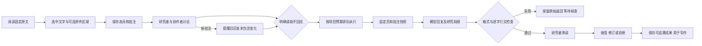

# Canwoo：从阅读现场到可复查的研究成果

本轮根据整个产品讨论，把工作收在研究者实际要做的一条链上：读材料、标出疑问、讨论解释、请助手寻找依据、核查后再写作。Canwoo 的定位仍是能组织和复查研究的工作台；模型完成一次回答不等于完成历史研究。

## 本轮新增

- **阅读与校订分开**：默认阅读模式可选择文字；校订需要主动进入编辑，保存后产生新版本。文本资料的原始导入内容可展开核对，减少重复文本占满页面。
- **持久高亮**：选中文字并留下问题与第一条批注；关联固定版本、页码、准确字符位置。图片/PDF 可同时附上手动框选区域。重叠摘录可分别选择，旧版本高亮不会自动移到新文字。
- **围绕原文讨论**：当前阅读页和选中的讨论每 5 秒更新，隐藏页面暂停。评论可由有权限的成员添加，owner/reviewer 可标记解决。服务器持续验证项目权限，撤权后停止读取并隐藏内容。
- **批注助手**：研究者明确提交问题后运行模型。助手读取固定页、摘录和最近最多 8 条讨论的限长快照。回答显示原文引用、具体局限、任务进度与人工复核入口。后续讨论只提示旧回复未包含变化，不覆盖旧答案、不自动重新扣费。
- **可恢复的输入**：尚未提交的批注、助手问题和待确认的请求编号保存在本机草稿中。网络响应丢失后重试复用同一请求；服务器并发请求也只派发一次。新建高亮的第一条评论发送失败时保留表单，并复用已保存的锚点。
- **返回研究现场**：项目概览列出未解决的阅读讨论，直达固定页和具体高亮。同页超过 100 条时，指定的旧批注仍可按链接打开。研究包恢复会重映射批注链接和任务里的锚点 ID。
- **约束输出**：真实 GLM 测试暴露 JSON 格式问题后，阅读助手采用专用严格结构。服务器独立检查编号与逐字引文，错误结果保留为待核查；不会猜修后自动发布。

## 从此前讨论保留下来的产品重点

已有功能覆盖注册与登录、项目成员权限、Google Drive 导入、PDF/图片与 OCR、资料版本、笔记管理、证据与书目、研究计划及任务图、多厂商模型连接、预算、检索与关注、研究包导出恢复、中英界面及浅色/深色主题。相关实施与验证边界见现有 `saas-quality.md`、`productivity-workflows.md`、`agentic-workflows.md`、`method-validation-and-appearance.md`。

后续优先级应由真实研究任务决定，而不是继续堆菜单：

| 研究者的问题                               | 下一步值得验证的改进                                             | 当前边界                                                       |
| ------------------------------------------ | ---------------------------------------------------------------- | -------------------------------------------------------------- |
| 一页扫描上没有可靠转录，也想先标记疑问     | 独立于文字证据的图像区域批注，以及明确提供该页图像的视觉追问     | 本轮区域高亮必须关联已核查的转录；没有文字时先转录，不伪造引文 |
| 同一个名字在不同时期、语言和拼写中如何对应 | 从研究者接受的别名与实体判断构建跨资料检索；显示歧义             | 不把模型自动合并的人名当作已经证实的同一人                     |
| 材料很多，如何知道助手漏掉了什么           | 保存研究方法、抽样复核、遗漏记录和人工对照耗时，逐步扩到不同文类 | 单页模型成功不能证明批量研究的准确率或时间收益                 |
| 新材料是否改变已写出的解释                 | 让依赖提醒落到具体论点与笔记，提供可审阅的修改建议               | 不自动重写研究者已接受的论述                                   |
| 多人如何真正同时写同一篇长文               | 先观察评论与现有版本流程是否够用，再决定是否需要共同编辑         | 本轮是约 5 秒的讨论同步，不是逐字符共同编辑或 WebSocket 推送   |

不为本轮另加 LanceDB、数据库或在线协同服务。现有 Cloudflare D1/R2、后台任务和模型预算可以承担这条工作流；是否需要更多语义/多模态索引，应以实际检索召回和费用数据决定。

## 验证结论与验收标准

真实公开 LED 铭文的测试细节在 `reading-pilot-validation.md`。第一次格式失败正确被拦下，修正后两条逐字引文通过，人审待处理且未发布成果；两次应用估算合计 $0.001339。模型仍存在解释过于确定、句子与引文语义支持不足的问题，具体局限必须在阅读界面中可见。

软件验收以能完成下列流程为准：保存高亮 → 刷新仍可见 → 讨论同步 → 草稿恢复 → 固定上下文回答 → 逐字核查 → 人工复核 → 导出恢复后仍能定位。面向学者的实际生产力验收还需要真实研究者带着自己的材料完成任务，记录遗漏、错误采纳和包含复核在内的总耗时。当前适合有人工核查的小规模试用，不能宣称人文研究已经自动化。

## 本轮浏览器与回归验收

- 完整测试 107 项通过；最终相关的阅读、草稿、输出与高亮回归 22 项通过。类型检查、lint、主站生产构建、后台 Worker 打包检查通过。
- 浏览器从项目概览打开确切的 LED 摘录，实际双击选词、保存高亮与首条讨论；新高亮与原有长摘录重叠时仍保留各自的准确位置。
- 两个阅读视图之间显示了后续讨论，无需手动刷新。可见页面约 5 秒同步，隐藏页面不调用模型。
- 成功的真实模型研究包已通过应用 API 恢复到本地。网页显示原回答、两条引文、后续批注变更提示，以及三条具体的研究局限；未恢复密钥、没有发布成果。
- 中文、英文与深色回复均可读取。390 px 手机视口下页面宽度为 390 px，无横向溢出，回复区域宽 306 px；临时视口覆盖已恢复。
- 另用现有 LOC 1863《解放宣言》转录 PDF 检查两页原件预览。持久区域覆盖层与画布边界一致；框选模式下已有高亮禁用点击，不挡新选择；键盘选整页并保存带换行的原文片段后，原件区域和文字高亮都保留。此条标记明确标注为界面验收，不作为历史解释。
- 原件区域只来自本次手动选择，浏览已有批注不会把它的区域误附到新文字。保存后清除临时选区，较小区域优先可点。未转录的图像页显示先转录的明确提示。

日志与研究包保存在 `work/reading-pilot/`。本地实例包含「真实模型阅读验证 · LED 高亮与批注」，与生产研究项目分开；它展示软件的可复查过程，不能用作模型整体准确率宣传。

## 发布验证

- 主站版本：`54dd6c2b-58b0-4172-833d-6b2968a62801`。
- 后台研究 Worker：`6fb6dded-d184-432b-991a-52578cef06fe`。
- 线上首页、隐私页返回 200；阅读 GET/POST 和研究概览的匿名请求返回 401，私有 GET 不缓存；工作区 JS 的 SHA-256 与最终生产构建一致。详见 `work/reading-pilot/production-checks.json`。
- 使用已登录 Chrome 真实账号只读打开「解放宣言的适用范围 · 公开史料研究」，新版阅读/校订切换、PDF 预览、模型连接与页码正常，深色界面无横向溢出，未发现控制台错误；未改写该生产项目材料或调用模型。
- 没有新增数据库迁移、服务或固定订阅。批注刷新使用现有 D1，模型仅由研究者明确发起并使用项目预算。
