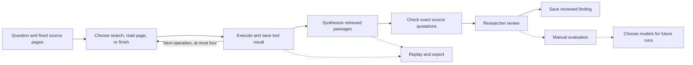

# Bounded research execution and replay

In **Research plans**, select **Guided investigation: search, read and hand off**. Pick fixed source pages and confirm the project budget before starting. This uses the existing D1 database and research queue; it adds no service subscription or agent framework.

## Execution boundaries

- Each decision and tool operation is a persisted mission task. Queue redelivery, leases, source-change invalidation, permissions and budget reservations use the existing execution system.
- Four exploration operations are available. Choosing `finish`, repeating an operation (including search case/whitespace variants), or reaching the allowance stops exploration. Subsequent decision tasks record the stop without paid calls. An empty evidence ledger produces an insufficient-material handoff without paid synthesis.
- Search is restricted to selected versions and pages, with at most six excerpts per operation. Reading returns at most 8,000 characters from a selected page. Use the returned `next_start` as the next operation's `start` to continue a long page; each operation records its actual range and total length. Skipped portions remain unread. These are corpus tools, not an unrestricted web browser.
- Decisions receive a page catalog and previous tool results. Synthesis receives passages derived only from returned tool text, not unread source contents. Models select numbered passages; Canwoo fills exact quotations and offsets. Reports support at most 24 distinct citations; older dossier contracts retain their 12-citation limit.
- Model decisions use a separate structured-output contract so answer-writing and citation instructions cannot conflict with tool selection. These are portable JSON action decisions, not provider-specific native tool sessions.
- Completion means an output exists. A reviewed finding still requires a researcher to inspect the evidence and accept the review. No automatic check establishes historical truth or adequate archival coverage.

## Recovery and diagnostics

Saved diagnostics contain the response stage, failure code, elapsed milliseconds and a request identifier when available. They omit keys, headers and provider error bodies. A missing identifier means the provider did not expose an accepted identifier.

A transport timeout, incomplete response, invalid output, and local result handoff are distinct conditions. A timeout alone cannot identify which network or provider component caused the delay. Uncertain paid requests retain their reservation and are never automatically replayed.

A confirmed saved response can recover after a local handoff failure without a new paid request. After an application validator repair or a repeated local delivery failure, **Recheck saved answer** explicitly revalidates the saved answer against current checks and resumes saving it. It retains the attempt and checks permission, mission state, fixed inputs and dependencies. It does not accept the historical interpretation or call the model.

## Replay and evaluations

**Execution replay** shows tasks in dependency order, their status, and expandable model diagnostics. Exported JSON includes fixed source text, inputs, results, job responses and metadata; treat it as private research data. Leases and credentials are excluded. Exports are bounded to 100 pages and 8 MB, with an early execution-record size check.

A replay file can be checked locally in the browser without upload or paid inference. Replay checks its checksum, exact quotations, selected page scope and investigation tool/report contracts. It also checks dependency cycles, duplicate identifiers, preceding-ledger continuity, decision-to-operation matching, stop boundaries and source reading ranges. It checks current saved task results; retained older provider responses are available for inspection, not rerun as paid calls. This is not arbitrary code replay, an authenticity signature, or a historical interpretation evaluator.

A completed investigation report has a manual evaluation form: missed evidence, unsupported claims, factual/context errors and review time. Evaluations are attached to the result revision and method/model metadata. The model selector can show current project evaluations of the same recipe; changing a model connection prevents its new model from inheriting the old model's measurements. These observations are not a controlled accuracy ranking or proof of speedup.

Exploration uses the chosen assistant at low reasoning effort. The researcher can explicitly choose another assistant and rates for high-effort synthesis within the existing budget. There is no blind model escalation or timeout-driven fallback. No model has yet been established as superior by a controlled Canwoo benchmark.

## Methods and conversation context

Saving a method creates an immutable edition. Saving a change to a selected method creates a new edition pointing to its parent; the server assigns the version. Separate branches may share an edition number but have distinct IDs. Each research task stores the actual method instructions, fields and version used.

Follow-ups keep the original and explicitly selected preceding task as their context. A deterministic handoff selects relevant existing prose and quotations, preserves explicit limitations and next checks, and marks shortened or omitted text. Full records remain stored. Restricting a follow-up to newly selected pages continues to omit prior answer content. This is bounded context selection, not unlimited conversational memory.

## Migration and validation

Apply `drizzle/0022_research_harness.sql` before running the changed app and research worker. It adds optional diagnostics and task failure-stage columns; existing rows need no backfill. The repository's standard type, lint, formatting, migration, regression and Cloudflare build commands apply.

The implementation is covered by scope, duplicate delivery, early finish, timeout accounting, immutable methods, model attribution, context retention, replay integrity and saved-response recovery tests. See [the live Adams trial](research-harness-validation-2026-09-07.md) for observed outcomes and limits.
