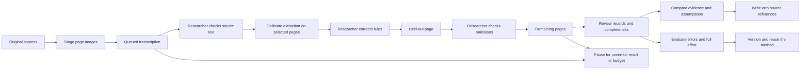

# Research-scale implementation

This checklist translates the research report into product acceptance criteria. Existing provenance, budgets, permissions, review gates and private deployment remain the foundation. Features explicitly deferred by the report (unrestricted publication, a generic agent marketplace and speculative database migrations) are not part of this work.

## Ordered delivery

- [x] 1. Durable batch transcription: stage fixed page images, run after the browser closes, reuse completed candidates, pause/cancel/resume, preserve uncertain charges, expose per-page progress and record transcription-to-correction derivation.
- [x] 2. Extraction completeness: explicit completeness/overflow/illegibility reporting, deterministic checks, independently selected calibration and validation pages, visible scope and omissions.
- [x] 3. Research comparison: source-linked tabular output, raw versus interpreted values, uncertain dates and identities, duplicate/source-dependence inspection, reproducible sensitivity calculations.
- [x] 4. Evaluation: complete human-time ledger, separate record-inclusion precision/recall, missing and inferred field counts, review coverage, matched baseline recording, frozen benchmark inputs and reproducible scoring without paid calls.
- [x] 5. Reusable methods: portable versioned method packages with examples, evaluated scope and limitations; explicit researcher approval before applying a method to another plan.
- [x] 6. Integrated workflow: ordered researcher-facing progress, actionable review/coverage states, exports and recovery/permission/regression tests.

## Where researchers use it

| Step            | Entry point                                                          | What is preserved                                                                                                 |
| --------------- | -------------------------------------------------------------------- | ----------------------------------------------------------------------------------------------------------------- |
| Transcribe      | Sources & reading → PDF/image → batch transcription                  | Fixed source version, staged page images, model snapshot, per-page results and cost reservations                  |
| Correct         | Read a page → inspect OCR candidate → save reviewed text             | Original version, reviewed candidate, reviewer and correction lineage                                             |
| Calibrate       | New research plan → Extract records → calibration and held-out pages | Distinct selected pages, extraction fields, method examples and scope                                             |
| Review coverage | Research plan → Review overview & research records                   | Planned/output/accepted counts, incomplete pages, missing values and source quotations                            |
| Correct records | Open a task → Correct records                                        | Original output, corrected edition, completeness statement and review reason                                      |
| Compare         | Records in this study → Compare records and check counting choices   | Acceptance filter, inferred-value switch, exact-quotation deduplication, date bounds and source-group assumptions |
| Evaluate        | Open a task → Record a manual page evaluation                        | Whole-scope confirmation, errors, full human time, separate waiting time and optional matched baselines           |
| Reuse           | New research plan → Method notes, examples and reuse                 | Portable method version, examples, tested scope and limitations; import preview before application                |



The existing task workflow view exposes the generated dependencies and current states. Saving a plan does not start model calls. Corrections and method imports do not silently rewrite other projects.

## Operating boundaries

- Batch OCR accepts up to 100 selected pages per batch, with JPEG page images up to 2 MB each. Keep the browser open until image staging finishes; execution then belongs to the queue. Temporary storage counts against existing quotas. One active batch per model-account owner avoids concurrent hidden spending.
- Background execution needs the existing queue consumer and maintenance schedule. Maintenance redispatches queued rows, reconciles saved results and cleans completed/cancelled temporary images. Staging abandoned before completion can be continued or cancelled from the source page.
- Reviewing one page does not invalidate saved OCR candidates for unchanged pages of the same original. Reuse checks page text, source identity and revision ordering on the server; editing that same page blocks reuse. Each saved correction retains both the immediately preceding version and the original OCR run.
- Provider timeouts and interrupted calls keep uncertain cost reservations. They do not trigger automatic paid retries. Inspect saved results and provider usage, then explicitly choose how to continue. Changing the source version or model configuration stops further calls.
- New extraction outputs declare `complete`, `partial` or `illegible` and state remaining records/limitations. A page can contain at most 20 output records per extraction task: overflow must be declared rather than silently called complete. Partial or illegible results require human review before dependencies continue. Older results remain readable and are flagged when completeness is unconfirmed.
- Counts describe source-linked observations, not distinct people or historical events. Similar names are not automatically merged. Source groups are researcher-supplied dependence assumptions, not a model's proof of independence.
- Date filters recognize explicit year, ISO-shaped date and year-interval notation. Unknown dates remain unknown. Calendar conversion, inferred exact dates and automatic historical identity resolution are not supplied.
- Missing fields are reported separately from wrong values. They can reflect missing source information or model omissions; they are not automatically classified as correct abstentions. Record-inclusion precision/recall requires whole-scope review and does not measure interpretation quality.
- Full human time combines preparation, configuration, review/rework, analysis and writing. Waiting is recorded separately. Unmeasured entries remain blank; a measured zero is distinct. Shared preparation must be allocated across pages. Baseline ratios require the same scope and quality standard, positive time, and a complete ledger.
- Method packages contain editable instructions and examples, not executable code, credentials or automatic publication actions. Export only examples you have permission to share. A package's reported evaluation scope is a researcher's statement, not an independent certification.

## Reproducibility

Download a comparison from the panel, then recompute it from the frozen task snapshots:

```sh
npm run research:replay -- /path/to/clioforge-comparison.json > recomputed.json
```

The command validates the package version and recomputes counts from snapshots instead of trusting its supplied totals. It records an input SHA-256 hash. Keep the original package when changing assumptions; each comparison is an auditable alternative, not an overwritten result.

Run the offline Franklin metadata benchmark:

```sh
npm run research:benchmark
```

The checked-in Stanford dataset has 3,443 document records, 774 people and 339 places. Original file hashes, missing endpoints, date precision and counting rules are fixed in the fixture manifest and expected report. CI runs this check. The dataset is CC BY 4.0 with attribution in `tests/fixtures/franklin/README.md` and `THIRD_PARTY_NOTICES.md`; linked letter images and transcriptions are not redistributed.

## Evidence gates

Software tests and synthetic provider runs establish application behavior only. A controlled productivity study requires independent researchers, held-out material and complete time measurements; it cannot be marked completed by an agent simulating all participants. This implementation does not claim a measured advantage over manual research or ChatGPT. No paid model calls or production deployments were made during this validation.

## Validation log — 2026-09-12

- `npm test`: 320 tests passed, zero failures. Includes local D1/R2 OCR execution, duplicate delivery, pause/resume, cancellation, uncertain provider failure, model/source changes, budget and ownership checks, reviewed-text derivation, completeness gates, held-out selection, comparison replay, method packages and timing arithmetic.
- `npm run check`: English-comment check, TypeScript and lint passed.
- `npm run build:cloudflare` and `npm run check:jobs`: application production build and background Worker dry run passed.
- `npm run check:migrations`: 23 existing migrations unchanged; migration `0024_research_scale.sql` appended. Applied only to the local validation database.
- `npm run research:benchmark`: all 3,443 document records, input hashes and descriptive scope counts matched.
- Browser: signed in with a synthetic local account, imported 40 public LED inscriptions, exercised comparison options, corrected incomplete output, saved a full timing evaluation, accepted a reviewed result, imported/previewed/applied/saved a method package and generated a 14-step draft with separate calibration and held-out pages. Synthetic output and timing are explicitly labelled as interface fixtures, not scholarly or productivity evidence.
- Standalone comparison replay reproduced the saved local mission comparison exactly, including its source snapshots and assumptions. Gitleaks found no secrets in the changed files.
- UI: adjusted comparison controls, explanatory text, action spacing, bilingual error messages and page-step count labels. Checked the generated workflow visually.
- Browser validation found missing development-module routing at the private Worker entry. The fix remains after the access gate and is compiled out of production; private-access runtime tests pass.
- The local Wrangler production-preview proxy exited with `Network connection lost` during browser checks. Production rendering was inspected; final write/read checks ran successfully against a freshly started Vite/Cloudflare development server. A development hot-reload theme-context mismatch was not reproduced after that clean restart; the production page showed the correct theme. These local-tool limits are not reported as a completed remote deployment check.
