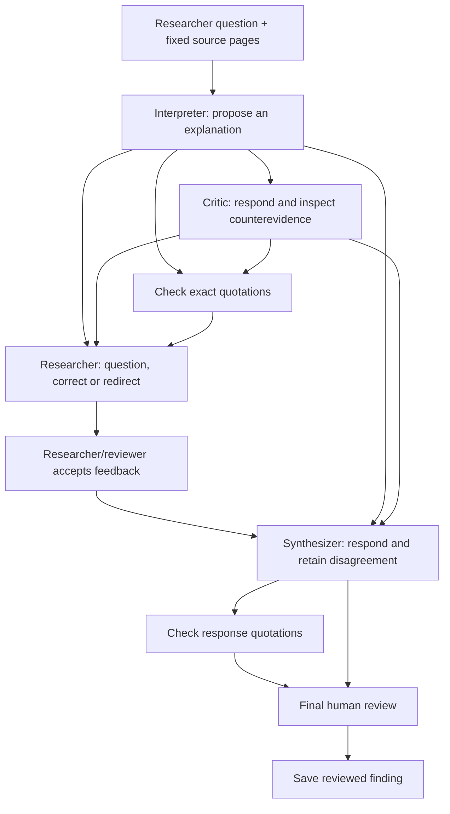

# Rich writing and bounded research discussions

Implemented 2026-09-05 (deployment verification recorded below).

## Editor choice

ClioForge uses Tiptap 3.31.3 (MIT core/extensions), KaTeX 0.18.6 and Excalidraw 0.18.1 (MIT). No Tiptap Cloud subscription, hosted collaboration service or additional database is required. The editor and drawing canvas load lazily. Drawing fonts are self-hosted.

- [Tiptap React](https://tiptap.dev/docs/editor/getting-started/install/react) is headless, allowing ClioForge's existing controls and theme to remain consistent.
- [TableKit](https://tiptap.dev/docs/editor/extensions/nodes/table) supplies editable/resizable tables; text styles supply family, size and color.
- [Mathematics](https://tiptap.dev/docs/editor/extensions/nodes/mathematics) uses KaTeX for inline/display LaTeX. Clicking an equation opens its source for editing.
- [Excalidraw](https://docs.excalidraw.com/docs/@excalidraw/excalidraw/installation) supplies freehand drawing, shapes, text and connectors. React 19 is declared in the installed package's peer dependencies.
- [BlockNote](https://www.blocknotejs.org/docs/features/blocks) is a good block-oriented alternative. Its opinionated editor UI is less useful here because ClioForge already has navigation, materials, evidence and version management.
- [Lexical](https://lexical.dev/docs/intro) is another extensible foundation; implementing this specific set of tools would require more assembly. This is a product-fit choice, not a universal ranking.

Tiptap's [Markdown support is beta](https://tiptap.dev/docs/editor/markdown) and Markdown cannot represent every table/layout feature. Consequently, the editable document is stored separately from the readable text projection.

## What researchers can do

Notes now have headings, font family/size/color, bold/italic/underline, lists, undo/redo, tables with row/column and merge/split controls, editable equations, and drawings that can be reopened. Existing evidence links can still be inserted into the document.

D1 migration `0015_rich_notes.sql` adds nullable `notes.document`. Legacy notes remain Markdown until edited. New rich notes store a bounded Tiptap document, including editable drawing scene plus a PNG preview. The server derives `body` from that document for existing search, citation export and model context, rather than trusting a client-supplied projection. Immutable note revisions, stale-parent rejection and retry identity all include the rich document. Local drafts preserve it too.

Complete document JSON export/import preserves the full editing representation. Project ZIP backups retain it and remap internal citation links on restore. Word/Markdown export currently preserves text, source links/footnotes and LaTeX source, not Word-native formulas, rich table layout or drawing objects; the UI discloses this. Text comparison reports text changes and separately notes formatting/drawing changes.

Bounds: 100,000 text characters; 700,000 UTF-8 bytes per complete document; up to 500 drawing elements, 200,000 scene characters and a bounded PNG preview. External image/iframe/embedded-site drawing elements are not accepted. KaTeX `trust` is disabled. Imported document node types, hierarchy, depth and size are validated. Drawing captions are included in model text; the model does not receive the drawing image in this workflow.

## Research discussions

From a note, researchers select a passage (or use the full note up to 6,000 characters), ask a question and choose up to three sources/24 readable pages. This creates a draft mission, not a paid call. The question is kept with the local note draft. The mission records the exact passage, question and source versions/pages. The model connection and rates are visible; execution uses the existing project allowance.

The same recipe is available from Research plans. All three model steps use the selected model with different roles, not independent scholars or a voting system. Interpretation/critique use high effort; synthesis uses max. Existing routing determines provider support.

Role labels and task IDs are preserved in dependency context. OpenRouter/OpenAI discussions request the named strict `research_discussion_v1` format; citation-number and exact-source checks remain mandatory after decoding. Other providers retain native request behavior and the same result checks. The transcript shows responses and task state, with links into existing source/citation inspection and review controls. Feedback is submitted and then accepted before synthesis can run. Final review remains separate. Ordinary comments do not automatically trigger paid work, and no assistant edits the source note. The workflow has three model steps, not an open-ended debate.

## Validation

- 114 regression tests passed, including the installed editor's actual Markdown parse/format/table/math serialization, invalid document rejection, immutable save/retry/conflict handling, and full ZIP restore with rich citation remapping.
- The research workflow test runs the real execution/budget/dependency infrastructure with a deterministic model fixture. It verifies that the critic receives the interpretation, synthesis receives researcher corrections only after acceptance, repeat dispatch does not call the model again, and final publication stays blocked pending review. This does not establish historical interpretation quality.
- Seven authenticated localhost API checks passed. A rich LED reading note remains in the local QA project; the test mission was cancelled and its temporary invalid model credential removed. No new paid inference was run.
- Typecheck and lint pass. Main Cloudflare build and background Worker dry run pass.
- The Mac is locked. Browser interaction, visual layout, Excalidraw pointer tools and nested-dialog behavior have not been verified this turn. Headless editor checks do not replace browser QA.
- New production dependency advisories were fixed via explicit nanoid/lodash-es overrides. Four inherited moderate development-tool advisories remain in the existing drizzle-kit/esbuild chain; no blanket forced dependency downgrade was performed.

Not implemented here: simultaneous collaborative cursors/CRDT editing, automatic token-by-token model rewriting, autonomous open-ended agent debate, or new historical accuracy benchmarks. Existing immutable versions and explicit researcher acceptance remain the collaboration boundary.

## Deployment verification

- Production D1 migration 0015 applied successfully.
- Main app: `60c892f9-60ea-42c7-873b-804ba6672ed5`.
- Background Worker: `c7e09dc0-2c53-4ce1-977f-0913272107e7`.
- Nine live HTTP checks passed: exact editor/canvas JavaScript and CSS hashes, self-hosted font bytes, homepage availability, and 401 responses for unauthenticated workspace/writing/platform APIs. See `work/rich-writing/live-checks.json`.
- These deployment checks do not verify a logged-in browser's pointer, keyboard or visual behavior.
